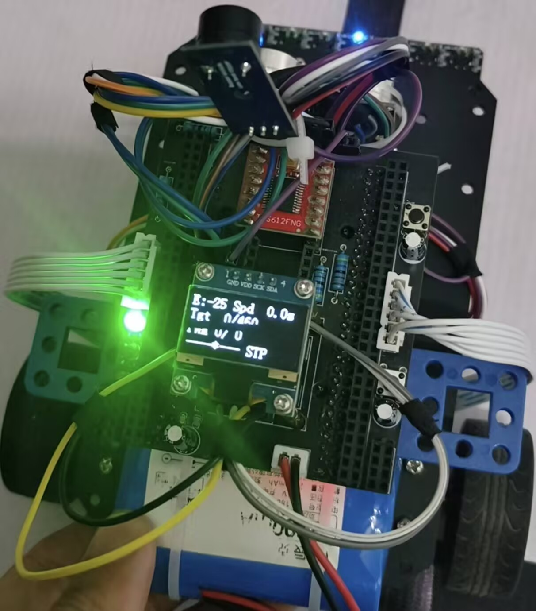
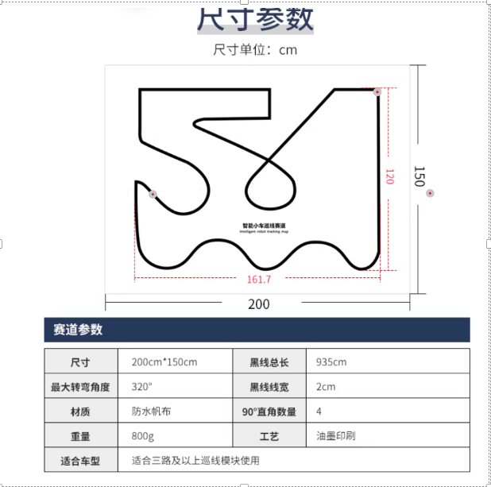

# 八路循迹智能小车

基于 STM32F103ZET6 的八路红外循迹智能小车，采用双环 PID 闭环控制（循迹 PD 外环 + 速度 PI 内环），实现高速稳定循线、弯道自适应减速、超声波避障等功能。Keil uVision5 工程，标准库开发。

---

## 目录

- [实物与赛道](#实物与赛道)
- [控制策略](#控制策略当前-v7-主流程)
- [硬件设计资料](#硬件设计资料)
- [器件材料表](#器件材料表)
- [功能特性](#功能特性)
- [项目结构](#项目结构)
- [开发历程](#开发历程)

---

## 实物与赛道

<p align="center">
  
</p>

### 赛道参数



| 项目 | 参数 |
| --- | --- |
| 赛道整体尺寸 | 200 cm × 150 cm |
| 黑线总长 / 线宽 | 935 cm / 2 cm |
| 图中黑线包络尺寸 | 约 161.7 cm × 120 cm |
| 最大转弯角度 / 90° 直角 | 320° / 4 个 |
| 材质与工艺 | 防水帆布、油墨印刷 |
| 赛道重量 | 约 800 g |

赛道同时包含连续 S 弯、回环、直角转弯和交叉区域；控制程序通过八路加权误差、动态比例增益、微分抑振和弯道减速来处理这些路段。

---

## 控制策略（当前 V7 主流程）

当前运行入口是 `User/main.c`：循迹 **PD 外环** 根据黑线偏差生成左右轮目标速度差，速度 **PI 内环** 根据编码器反馈输出左右电机 PWM。

```text
八路红外 → 加权循迹误差 → PD 外环 → 左右轮目标速度
编码器速度 ─────────────────────────────→ PI 内环 → TB6612FNG PWM
```

### 外环：循迹 PD

```text
turn = dynamicKp × trackError + TRACK_KD × dError
```

- 基础参数：`TRACK_KP=12.0`、`TRACK_KD=2.5`；`dynamicKp` 随误差增大而调度，最大为基础 `Kp` 的 4 倍。
- 外环没有积分项，因此不使用 `INTEGRAL_MAX`；`TRACK_KP` 的数值尺度也不能与速度环的 `SPEED_KP` 直接比较。
- 大误差时同步降低基础速度，并允许内侧轮降至 0，以缩小转弯半径。

### 内环：左右轮速度 PI

```text
e = targetSpeed - measuredSpeed
I = clamp(I + e, -INTEGRAL_MAX, +INTEGRAL_MAX)
PWM = clamp(SPEED_KP × e + SPEED_KI × I, PWM_MIN, PWM_MAX)
```

- 当前参数：`SPEED_KP=0.15`、`SPEED_KI=0.08`、`INTEGRAL_MAX=200`、控制周期 2 ms。
- `INTEGRAL_MAX` 只限幅积分累计值，不会乘到 `SPEED_KP` 上；积分项仍是 `SPEED_KI × I`。积分饱和时，最大积分贡献为 `0.08 × 200 = 16`。
- 当前实现的积分累加没有乘 `dt`，因此 `Ki` 与控制周期绑定；调参时应先令 `Ki=0`，确认 `Kp` 后再逐步加入 `Ki`。
- `Kp≈0.20` 可作为速度内环的待测高增益点，但当前提交值仍为 `0.15`；不能把 `0.20` 写成已验证的固定参数。

`Hardware/app_control.c` 与 `Hardware/app_motor.c` 保留了早期控制封装；本 README 的当前控制策略和参数均以 `User/main.c` 的 V7 主流程为准。

---

## 硬件设计资料

- [STM32F103ZET6 小车原理图（PDF）](Hardware/原理图/啄木鸟_STM32F103ZET6_原理图.pdf)：单页原理图，包含 STM32F103ZET6 主控、TB6612FNG 电机驱动、双路编码器、八路循迹模块、OLED、按键、超声波与电源接口。
- 当前仓库已包含该原理图 PDF；PCB 布局源文件和 Gerber 尚未提供。

---

## 器件材料表

以下链接用于复现时的采购参考；商品页上的价格、库存和可选规格以页面实时信息为准。

### 核心控制

| 器件 | 型号/规格 | 说明 | 采购参考 |
|------|-----------|------|------|
| 主控/最小系统板 | STM32F103ZET6 | Cortex-M3，72 MHz，512 KB Flash，64 KB RAM | [ZET 最小系统板](https://detail.tmall.com/item.htm?id=848907993335) |
| 小车底盘 | 定制亚克力/铝合金 | 适配循迹、主控与驱动模块安装 | [底盘](https://item.taobao.com/item.htm?id=839494092907) |

### 传感器模块

| 器件 | 型号/规格 | 说明 | 采购参考 |
|------|-----------|------|------|
| 循迹传感器 | 亚博智能八路红外（8xLP） | 当前 V7 通过 GPIO 直读 PF1–PF4、PF6–PF9；模块资料中的串口模式波特率为 115200 | [购买链接](https://detail.tmall.com/item.htm?id=856333096524) · [模块资料](https://www.yahboom.com/study_module/8-LP) |
| 陀螺仪 | JY301P | 仓库保留 I²C 驱动及 OLED 姿态显示支持 | [JY301P](https://item.taobao.com/item.htm?id=564096471299) |
| 超声波模块 | HC-SR04 | 前方避障测距，非阻塞轮询，60 ms 采样周期 | [HC-SR04](https://detail.tmall.com/item.htm?id=41248598447) |

### 驱动与动力

| 器件 | 型号/规格 | 说明 | 采购参考 |
|------|-----------|------|------|
| 电机 | G310 霍尔编码器电机 | 带 AB 相正交编码器，11 PPR，1:20 减速比 | [G310 电机与轮胎](https://detail.tmall.com/item.htm?id=678032084707) |
| 橡胶轮 | 48 mm | 配套 G310 电机 | [G310 电机与轮胎](https://detail.tmall.com/item.htm?id=678032084707) |
| 电机驱动 | TB6612FNG | 双路 H 桥驱动，支持 PWM 调速 | [TB6612FNG](https://detail.tmall.com/item.htm?id=717996181216) |

### 显示与交互

| 器件 | 型号/规格 | 说明 | 采购参考 |
|------|-----------|------|------|
| OLED 显示屏 | 0.96 寸四引脚 | I²C 接口，128×64 分辨率，分帧刷新 | — |
| 蜂鸣器 | 无源蜂鸣器 | 低电平触发，PWM 驱动，支持 8 种音效 | [蜂鸣器](https://detail.tmall.com/item.htm?id=21124132861) |
| LED | 多种规格 | 按正向压降和限流电阻选择；原理图含 LED 与蜂鸣器上下拉连接 | [LED 套件](https://detail.tmall.com/item.htm?id=610942801333) |

### 电源管理

| 器件 | 型号/规格 | 说明 | 采购参考 |
|------|-----------|------|------|
| 锂电池 | 辰克 2800 mAh（可更小） | 小型号端子，紧凑安装 | — |
| 电源端子 | 2.54 DC 母座 | 电池 DC 母头接口 | [DC 母座](https://item.taobao.com/item.htm?id=632184698346) |
| 降压模块 | MP1584 | 电池电压降至 5 V 稳压输出 | [MP1584](https://item.taobao.com/item.htm?id=522572489248) |

### 辅料与连接件

| 类别 | 明细 |
|------|------|
| 螺丝紧固 | M3 螺丝、铜柱、厚螺母；M2 螺丝、螺母 |
| 连接器 | 2.54mm 排针、排母 |
| 接线 | 杜邦线、面包板、面包板跳线 |
| 被动元件 | 10uF 直插电容、100nF 贴片陶瓷电容、4.7K 上拉电阻、1K 贴片电阻 |
| 指示器件 | 直插 LED（红/绿/指示） |

---

## 功能特性

### 1. 八路循迹：GPIO 高速识别

- 8 路红外传感器通过 GPIO 直接读取（PF1-PF4, PF6-PF9），读取耗时 <1us
- 非线性权重分布：`{-12, -8, -3, -1, 1, 3, 8, 12}`，边缘传感器权重更大，提升弯道灵敏度
- 加权求和计算循迹误差，支持丢线检测与方向推断
- 传感器值：0 = 检测到黑线，1 = 白色/无线

### 2. 双环 PID 闭环控制

- **外环（循迹 PD）**：根据循迹误差计算转向输出
  - 非线性 Kp 调度：误差越大比例增益越强（err=0: 1.0x → err=12+: 4.0x）
  - D 项抑制振荡，防止蛇形走位
  - 基础参数：`TRACK_KP=12.0`，`TRACK_KD=2.5`；不含积分项
- **内环（速度 PI）**：确保左右轮精确跟踪目标速度
  - 位置式 PI 控制，积分累计值限幅为 ±200
  - 参数：`SPEED_KP=0.15`，`SPEED_KI=0.08`；`INTEGRAL_MAX` 不参与比例项
- 控制周期 2ms（500Hz），高频保证响应及时

### 3. 弯道自适应减速

- 根据循迹误差自动调节基础速度：误差越大，速度越低
- 减速曲线：err=2 保持 97% → err=5 降至 77% → err=10 降至 45% → err=15+ 降至 12%
- 直线基础速度 650mm/s，弯道最低 60mm/s，上限 1100mm/s

### 4. 编码器测速与里程

- MG310 霍尔编码器，11PPR x 20 减速比 x 4 倍频 = 880 脉冲/转
- 左电机 TIM2（PA0/PA1），右电机 TIM3（PA6/PA7），硬件正交解码
- 实时输出：转速 RPM、线速度 mm/s、累计距离 mm
- 左轮方向反转补偿（ENCODER_L_INVERT=1）

### 5. 超声波避障（简易实现）

- HSR04 超声波模块，PA9(Trig) / PA10(Echo)
- 非阻塞轮询模式，60ms 周期自动测距

### 6. OLED 双页面显示

- 0.96 寸 OLED，软件 I2C 驱动（PB10/PB11）
- 分帧刷新策略：运行时 1000ms / 待机 800ms，避免 I2C 通信阻塞控制回路
- 双页面切换（短按 PC5）：
  - **循迹实时页**：循迹误差 + 平均速度、目标速度 L/R、PWM L/R、传感器状态条（避障时显示距离）
  - **参数页**：Kp/Kd 值、基础速度、运行计时、超声波距离
- 启动长按进度条动画，终点到达显示完赛时间

### 7. 按键控制与交互

- **PC5 按键**：短按切换 OLED 页面，长按启动/停止循迹（带进度条反馈）
- **PC4 按键**：运行中按下 = 紧急停止；待机时按下 = 循环 LED 亮度档位（4 档：48→30→15→3）
- 软件消抖处理，按键事件队列机制

### 8. LED PWM 亮度控制

- 3 路 LED：PB9（绿）、PE0（红）、PE1（指示）
- PWM 占空比控制亮度，4 档循环（48/30/15/3）
- 运行时 LED 熄灭降低干扰，终点到达触发灯效

### 9. 蜂鸣器多音效提示

- 无源蜂鸣器 PB8，TIM5_CH3 PWM 驱动，支持频率控制
- 8 种内置音效序列：
  - **开机音**：Do-Sol-高Do 欢迎音
  - **激活提示**：短响 1 声（Sol）
  - **1 分钟提醒**：短响 2 声（Mi-Mi）
  - **终点到达**：3 声升调（Do-Mi-Sol）
  - **成功提示**：上升音阶 Do-Mi-Sol-高Do
  - **错误提示**：下降音阶 Sol-Mi-Do
  - **警告提示**：急促四连响（La x4）
  - **按键音**：极短 30ms 响

### 10. 串口调试日志系统

- 运行时日志存储到 RAM（最多 1400 条 LogEntry，约 20 秒数据 @10ms 周期）
- 停车后通过 UART4（115200 波特率）导出 CSV 格式诊断日志
- 每条记录包含：序号、测试编号、时间戳、循迹误差、传感器原始值、左右轮 PWM/速度/目标速度、控制标志位、饱和信息、动态 Kp 倍率等 22 个字段
- 支持多次测试标记（testId），方便分段分析
- 可通过宏 `LOG_ENABLE` 开关日志功能

---

## 项目结构

### 1. 主控入口与调度：`User/main.c`

`main.c` 是当前 V7 版本唯一的运行主流程入口，负责：

- 系统初始化与启动音效
- 按键事件处理（PC5 启停/切页，PC4 急停/亮度档位）
- 2ms 高频控制环（循迹 PD 外环 + 速度 PI 内环）
- 超声波避障状态机
- OLED 双页面渲染
- 运行日志记录

关键时序（主循环内）：

- **控制环**：`2ms`（`if ((nowMs - lastControlMs) >= 2)`）
- **超声波触发**：`60ms`（`OBS_PERIOD_MS`）
- **外设更新**：运行 `100ms` / 待机 `20ms`
- **OLED 刷新**：运行 `1000ms` / 待机 `800ms` / 长按提示 `150ms`
- **运行态节流**：每圈 `Delay_ms(1)`

`main()` 主流程拆解：

1. **初始化阶段**：`SysTick/按键/红外/超声波/OLED/UART4/LED_PWM/蜂鸣器/电机编码器/PI参数` 依次初始化
2. **待机阶段**：允许切页与亮度档位调整，电机保持停止
3. **启动阶段**：PC5 长按进入运行，清零里程/计时/滤波/状态机并打日志分隔标记
4. **运行阶段**：
   - 读取传感器并计算误差（含丢线恢复、终点投票、方向记忆）
   - 计算动态 `Kp` 与动态基础速度
   - 外环 PD 生成转向量，内环 PI 生成左右 PWM
   - 电机输出 + OLED 刷新 + 日志采样
5. **停止阶段**：急停/终点触发后，停止电机并导出日志

### 2. 功能-文件映射（当前主流程）

| 模块 | 主要文件 | 关键实现 | 参数/依据 |
|------|----------|----------|-----------|
| 循迹采集 | `Hardware/bsp_ir_gpio.c/.h` | `IR_GPIO_Init`、`IR_GPIO_Read` | GPIOF 8路引脚映射（PF1-PF4, PF6-PF9） |
| 循迹控制 | `User/main.c` | 加权误差、丢线恢复、交叉抑制、动态 Kp、PD 转向 | `SENSOR_WEIGHTS_V5`、`TRACK_KP/KD` |
| 速度环 | `User/main.c` | `PI_Init`、`PI_Compute`、目标速度合成、PWM 输出 | `SPEED_KP/KI`、`INTEGRAL_MAX`、`PWM_MAX/MIN` |
| 电机驱动 | `Hardware/bsp_motor.c/.h` | `Motor_SetSpeedBoth`、方向与PWM映射 | TB6612 管脚与 20kHz PWM |
| 编码器测速 | `Hardware/bsp_encoder.c/.h` | `Encoder_Init`、`Encoder_Update`、`Encoder_GetSpeedMMS` | 11PPR × 20 × 4 倍频、轮径48mm |
| 超声波避障 | `Hardware/HCSR04.c/.h` + `User/main.c` | `HCSR04_Poll`、`HCSR04_StartMeasure`、状态机接管 | `OBS_WARN_CM/OBS_AVOID_CM/OBS_EXIT_CM` |
| OLED 显示 | `Hardware/OLED.c/.h` + `User/main.c` | `OLED_ShowString` 分帧刷新，双页面显示 | `DISPLAY_PAGES=2`，按状态切页 |
| 按键输入 | `Hardware/bsp_key.c/.h`、`bsp_key2.c/.h` | `Key_Scan`、`Key2_GetEvent` | C5短/长按与 C4 事件分离 |
| LED 指示 | `Hardware/bsp_led_pwm.c/.h` | `LED_PWM_Init`、`LED_SetBrightness`、`LED_StartFinishEffect` | 待机4档亮度、终点灯效 |
| 蜂鸣器 | `Hardware/bsp_buzzer.c/.h` | `Buzzer_PlayBeep`、`Buzzer_BeepTriple`、`Buzzer_Update` | 启动/激活/急停/终点提示 |
| 串口日志 | `User/main.c` + `Hardware/bsp_usart.c/.h` | `Log_Add`、`Log_Start/Stop`、`Log_Export`、`UART4_Send_String` | `LOG_ENABLE`、`LOG_PERIOD_MS`、`LOG_MAX_ENTRIES` |

### 2.1 重点文件补充说明

- `Hardware/bsp_led_pwm.c/.h`：当前 LED 主实现，负责三路亮度 PWM、亮度档位、终点灯效。
- `Hardware/app_ui.c/.h`：历史 UI 页面框架（含陀螺仪页等），当前 主流程未调用，现行显示逻辑在 `User/main.c` 内直接渲染。
- `Hardware/app_motor.c/.h`：历史运动封装（`Motion_Car_Control`），当前  主流程主要直接走 `bsp_motor + bsp_encoder + main.c 内 PI`。
- `Hardware/bsp_encoder.c/.h`：编码器采样与速度/里程计算，给主循环速度环提供反馈。
- `Hardware/bsp_ir_gpio.c/.h`：循迹输入底层，8 路 GPIO 快速读取。
- `Hardware/bsp_buzzer.c/.h`：蜂鸣器音效状态机，主循环按周期调用 `Buzzer_Update`。
- `Hardware/HCSR04.c/.h`：超声波非阻塞测距，主循环轮询并驱动避障状态切换。

### 3. 参数集中位置（调参入口）

当前版本参数集中在 `User/main.c` 顶部宏区，便于赛道调参：

- **速度环参数**：`SPEED_KP`、`SPEED_KI`、`INTEGRAL_MAX`
- **循迹参数**：`TRACK_KP`、`TRACK_KD`
- **速度边界**：`BASE_SPEED_MMS`、`MIN_SPEED_MMS`、`MAX_SPEED_MMS`
- **避障阈值**：`OBS_WARN_CM`、`OBS_AVOID_CM`、`OBS_EXIT_CM`
- **日志参数**：`LOG_ENABLE`、`LOG_PERIOD_MS`、`LOG_MAX_ENTRIES`

建议调参顺序：

1. 先调速度环（确保左右轮可稳定跟踪目标）
2. 再调循迹环（Kp 响应、Kd 抑振）
3. 最后调避障阈值和基础速度

---

## 开发历程

这一部分保留项目从学习、选材、原理图、PCB 到代码规划的真实过程。  
写法上尽量保留当时的直观经验，但把格式整理成后续能继续维护的 Markdown。

---

### 1. 理论知识学习指标

- **江科协 32 单片机：** 先补齐 STM32 基础知识，重点包括：
  - IO 口、上拉电阻、LED 控制。
  - 按键电容、软件消抖。
  - 通用寄存器、高级寄存器、基本寄存器和定时器 `TIM` 的区别。
  - TB6612 驱动模块如何通过方向脚和 PWM 控制电机。

- **模块原理图：** 需要能看懂并画出常见外围电路。
  - 上拉电阻在原理图中的实现。
  - 三极管开关的设置限制，尤其是近地低端开关。
  - 滤波电容和去耦电容的摆放限制：小电容靠近芯片，大电容靠近电池或电源入口。

- **电路链路理解：** 先理解供电怎么走，再开始画图。

```text
电池端子
  -> MP1584 降压模块
      -> 单片机 5V
          -> 单片机 VCC / 3.3V
              -> 蜂鸣器
              -> 超声波
              -> OLED
              -> 陀螺仪
      -> 驱动 VM
      -> 驱动 5V
          -> 电机驱动
      -> OpenMV 5V 供电
      -> 循迹 5V 供电
      -> 三极管开关 5V 供电
```

---

### 2. 原理图绘制

#### 2.1 模块封装自制

- **绘制要点：**
  - 引脚顺序正确。
  - 引脚数量正确。
  - 引脚方向对应实物。
  - 放网络标签时注意不要粘连。

- **检查方式：**
  - 掏出实物一一对应确认引脚存在。
  - 给 `VCC` 或 1 脚做小圆点标注，例如 `0.01 inch` 小圈。
  - 模块的引脚顺序和原理图顺序要对应，后续 PCB 焊盘也要对应。

- **原理图要充分：**
  - 降压模块。
  - 循迹模块。
  - 驱动模块。
  - 超声波。
  - 蜂鸣器。
  - 单片机。
  - 排针引出。
  - 按键。
  - LED 灯。
  - OLED 显示屏。

- **原理图要丰富：**
  - 大多数模块用排针 / 排母占位。
  - 标记 `VCC` 引脚。
  - 备用引脚可以集中引出，增加板子的通用性。

#### 2.2 整体原理图

- **补全被动元件：**
  - 电阻。
  - 滤波电容。
  - 按键消抖电容。
  - LED 限流电阻。
  - 文字标注模块作用。

- **网络标签：**
  1. 首先确保单片机网络标签正确，把它作为全板检查点。
  2. 按照 `syscfg` 文件或配置表完成网络标签添加。
  3. 不使用的引脚利用非连接符占用。

- **自查：**
  - 没用过的模块和方法，先找视频和教程学一学，抄一抄，别凭感觉画。
  - 六脚自锁开关：学习哪侧是公共引脚，按下时哪侧联通。
  - 三极管开关：理解集电极、基极、发射极，以及三极管驱动方式。

- **网络标签验证：**
  - 网络标签都放置完成后，可以尝试删除模块侧或单片机侧网络标签。
  - 再跑 DRC 检查原理图，确认网络标签是否错误添加。

- **关键模块原理图：**
  - 重点检查电机编码器引脚顺序。
  - 编码器左右两边可能需要反过来，注意 `VCC/GND/A相/B相` 的变换。

- **原理图转 PCB：**
  - 通过原理图转换到 PCB。
  - 可以选中一个模块区域，右键进行布局传递。
  - 转 PCB 是反查原理图问题的重要检查点。

---

### 3. PCB 封装绘制

- **信息具备：** 绘制封装前至少要知道：
  - 模块整体物理尺寸。
  - 打孔位置。
  - M3 孔位可先考虑半径 `1.8 mm`。
  - 引脚序号从上往下如何对应原理图。
  - 原理图 `1` 脚、PCB 焊盘 `1`、实物 `1` 脚必须对应。

- **封装绘制顺序：**
  1. 放上对应间距焊盘。
  2. 做好 X/Y 轴对称和尺寸计算。
  3. 快速对称方法：以原点 `(0, 0)` 做相对偏移。
  4. 绘制略大的丝印。
  5. 长宽手动输入，这样除以 2 放置后更容易对称。
  6. 放小圆点标注 `VCC` 或 1 脚方向。
  7. 确认后可以全选元素组合，避免后续移动错位。

- **封装检查：**
  - 排针排母间距要确认，常规是 `2.54 mm`，有些循迹排线可能是 `2 mm`。
  - 直插和贴片封装要区分。
  - 模块有时自带排针，封装必须按实物来。
  - 摆放之后必须看 3D 预览，避免元件方向错误。

---

### 4. 准备阶段与材料选择

#### 4.1 开发路线

先在 `STM32F103C8T6` 上跑通基础模块，再迁移到资源更多的 `F103RCT6 / F103ZET6`：

1. 先开发电机、超声波、陀螺仪、循迹、OLED、按键等基础模块。
2. 再按最终核心板重新分配引脚。
3. HAL 库迁移相对方便；标准库也能迁移，但要注意型号和外设资源差异。
4. 迁移完成后，再组装并实车调试。

题目影响选型：

- 障碍区没有循迹黑线。
- 只靠循迹模块不够。
- 需要超声波避障和陀螺仪辅助。
- 电机最好带编码器，才能获取速度信息。

#### 4.2 材料选择

- 先搞定底板、电机、辅助轮。
- 多看孔位数据，后期能节约时间。
- 没有标注尺寸的模块要自己量。
- 电机配套板子不怕尺寸。
- 辅助轮可以用牛眼轮或万向轮。

#### 4.3 功能需求清单

| 类别 | 内容 |
| --- | --- |
| 供电 | 电池、电池插入端子、降压模块 |
| 主控 | STM32F103ZET6 或同系列大 32 |
| 驱动 | TB6612 / TP6612 电机驱动 |
| 传感器 | 八路红外/灰度循迹、超声波、陀螺仪 |
| 执行机构 | G310 电机、轮子、支架、带编码器测速 |
| 调试交互 | OLED、按键、LED、蜂鸣器、串口日志 |
| 被动元件 | `10uF`、`0.1uF` 滤波/去耦电容，`4.7k` 上拉电阻，LED 限流电阻 |
| 扩展 | 备用 IO、备用串口、备用 I2C、排针排母 |

#### 4.4 物料清单初版

| 物料 | 记录 |
| --- | --- |
| 电池 | 辰克电池，两针端子 |
| 降压模块 | `MP1584` |
| 电机驱动 | `TB6612 / TP6612` |
| 主控 | `STM32F103ZET6` |
| 循迹模块 | 亚博智能八路循迹红外传感器 |
| 陀螺仪 | `JY901 / JY301P` 类 |

---

### 5. 引脚和外设分配

#### 5.1 分配前提

引脚分配前必须先查数据手册，尤其是：

- `STM32F103ZET6` 引脚复用表。
- ZET6 引脚复用表 `p31`。
- 定时器、串口、I2C、GPIO 的复用关系。

推荐顺序：

```text
分配串口以及备用
  -> 分配定时器以及备用
  -> 分配 IO 口和其他不需要定时器的独立外设
  -> 分配额外备用引脚
```

#### 5.2 定时器与编码器

- 可以先把 default 项里的 `TIM_CHx` 引脚全部列出来。
- 编码器要选择 `CH1 / CH2`。
- `CH3 / CH4` 不能给编码器使用。
- 原因：`CH3 / CH4` 没有合适的硬件 `CNT` 计数器从模式关系，不能进行编码器模式计数。

原始记录：

| 功能 | 记录 |
| --- | --- |
| 左轮编码器 | `PA0 / PA1`，`TIM2 CH1 / CH2` |
| 右轮编码器 | `PA6 / PA7`，`TIM3 CH1 / CH2` |
| 系统计时 | 补一个 `TIM1` 或系统时钟，用来计时和切换状态 |
| PWM | 蜂鸣器和驱动马达分配给通用定时器 |

#### 5.3 分配原则

核心思想：

```text
一个萝卜一个坑
```

含义：

- 通过需要的定时器和通道选择引脚。
- 定下了一个定时器，就要配置这个通道寄存器归属。
- PWM 输出、输入捕获、编码器输入都优先看定时器资源。
- UART 串口是另一类独立资源，也要单独分配。
- I2C、普通 IO 等不依赖定时器，但也要避免冲突。
- 关键模块尽量使用不同串口作为输入，减少时序阻塞导致的调试影响。

#### 5.4 最后必须确认

1. 最后需要的所有引脚。
2. 电路连接关系。
3. 所有模块的原理图。
4. PCB 物理封装。
5. 封装和原理图关联。
6. 原理图检查。
7. 备用引脚是否引出。

#### 5.5 六脚自锁开关

- 有槽一侧是常闭端。
- 线路接远离凹槽的常开端。
- 公共端和连通性必须用万用表或实物验证。

---

### 6. 正式设计电路

#### 6.1 设计电路要知道的关系

| 项目 | 经验 |
| --- | --- |
| 原理图引脚 | 元件符号绘制时区分正反面，引脚顺序临摹实际模块 |
| 引脚名称 | 如 `PA0`、`VCC`、`GND`、`AIN1`，严格跟实物丝印一致 |
| 网络标签 | 同名表示连接，网络标签两两一对形成电路连接 |
| 一个萝卜一个坑 | 原理图引脚编号、PCB 焊盘编号、实物引脚位置必须一一对应 |
| ERC 类型 | 输入、输出、电源、无源类型影响 ERC 检查 |
| 滤波 / 去耦 | 小电容近芯片，大电容近电池或电源入口 |
| 数据手册 | 引脚功能要查表确认，不能凭感觉猜 |

#### 6.2 正式绘图注意事项

- 原理图分区域，每框一个功能区，框与框之间用网络标签连接。
- 引脚名称别标错，否则后续网络标签会错。
- 检查模块引脚和实物对应正确后，再打网络标签。
- 注意特殊模块，例如降压模块之后的连接、电机编码器方向、陀螺仪 I2C 上拉。
- `12V` 电池进降压变 `5V`，`5V` 到驱动和单片机 `5V` 口。
- 滤波电容可用 `10uF` 和 `100nF`。
- LED 需要限流电阻，按键可以加消抖电容。
- 芯片和模块不使用的引脚使用非连接标识。
- LED、二极管、电容方向要确认。
- 循迹采取串口响应时，引脚不复用，避免硬件一路烧毁。
- 按键和 LED 数量要满足启停、控制、切换等交互需求。
- 有些模块不是 `2.54 mm` 间距，要单独确认。

#### 6.3 原理图检查重点

| 检查项 | 说明 |
| --- | --- |
| 被动元件顺序 | 滤波小电容靠近芯片，大电容靠近电池 |
| LED 限流 | 引脚 -> `1k` 电阻 -> LED -> `VCC` |
| 引脚顺序 | 原理图引脚顺序要对应模块标注顺序 |
| 网络标签 | 检查错标、漏标、重名、误连 |
| 降压模块 | 检查引脚连通性和 `12V` 进入驱动模块 |
| 编码器 | 左右两边方向可能不同，重点检查 `VCC/GND/A相/B相` |
| 上拉电阻 | JY901 等 I2C 模块确认上拉配置 |
| 芯片排针 | 芯片和两侧排针顺序对应，并对照实物 |
| 被动元件 | 电阻、电容、二极管位置和方向 |
| 信号线 | 特殊信号线注意 3W 等基本规则 |
| 数据手册 | 重点检查功能存在性，例如 `TIM` 是否可行 |
| DRC | 无错误、无缺件、无漏掉题目要求、无误改引脚功能 |

---

### 7. PCB 设计

#### 7.1 绘制顺序

- 电路大纲：电池进端子，`12V` 进电机驱动 `VM`，另一路进降压变 `5V`。
- 芯片分发 `3.3V` 给其他模块。
- 原理图更新 PCB 后，先检查封装是否正确。
- 模块有时自带排针，电机、循迹等模块要对照实物。
- `2 mm` 和 `2.54 mm` 间距要区分，循迹排线可能是 `2 mm`。

#### 7.2 检查点验证

通过 PCB 检查元器件情况，加上 `syscfg` / 引脚配置表，可以反向证明原理图正确性。

PCB 阶段能暴露：

- 空焊盘。
- 连接错误。
- 封装不对称。
- 引脚分配冲突。
- 元件顺序错误。
- 网络标签重复。
- 焊盘宽度异常。

#### 7.3 封装标准

- 封装焊盘对称。
- 通过相对偏移做对称。
- 焊盘先整齐，再做丝印对齐。
- 刷新封装后重新检查。
- 题目要求的元件、开关、指示灯、芯片方向要满足要求。
- 被动保护元件、电阻、电容、模块和供电需求要具备。
- 三极管做开关时注意近地低端侧。
- 六脚自锁开关要确认公共端连通性。
- 四脚按键注意一侧是连通的。

#### 7.4 元件摆放

- 测量小车底板孔位，测两三对，对称放。
- M3 打孔可参考半径 `1.8 mm`。
- 锁定几个模块和孔位，避免连线时不小心移动。
- 板框和丝印大小先规定好；原始记录中提到 `100 mm x 100 mm` 免费范围。
- 循迹引脚放最前面。
- 编码器左右两边别搞反。
- 显示屏硬性要求正面。
- 指示灯在正面。
- 降压模块最好放正面，方便测量和排查。
- 位置不够时，可把小电容、电阻等被动元件放背面，但要注意高度。
- 排针排母和元件之间留出足够空隙，方便焊接。
- 摆放后一定看 3D 预览。

#### 7.5 连线规则

- 按原理图连接顺序走线，不要乱跳过元件。
- 优先从需要加粗的 `5V` 或驱动 `VM` 线开始。
- 后期线没有机会加粗，电源线要早规划。
- 按轻重缓急连线：电源、驱动、编码器、排针放后面。
- `GND` 和 `VCC` 可以先做上下贯穿主干线。
- 适当分线、过孔、加粗。
- 电源线可参考 `30 mil`，铺铜地线可参考 `20 mil`。
- 铺铜时尽量保证 `10 mil` 进线、`10 mil` 出线，共 `20 mil`。
- 可规定竖线走底层，横线走顶层，减少混乱。

#### 7.6 PCB 检查

主要手段：DRC。

明显错误：

- 铺铜前后都跑 DRC。
- 铺铜前先看除 `GND` 和过孔之外的错误。

隐形错误：

- 电机编码器方向是否正确，通过实物比划验证。
- 编码器左右两边上下相反时，确认是否需要扭线。
- 电池线、大电容、小电容、后级供电顺序是否正确。
- 是否画错原理图，例如没有区分先过电阻再进三极管。
- 六脚开关两侧是否用上，保证电流负载。
- 是否按原理图顺序接线，有时需要分线，不能错误串联。
- 元件位置和孔位尺寸是否正确。
- 板下尽量不放高模块，可以放被动元件。
- 切换图层时不要误移动元件，可用 `ALT + F`。
- 元件间距尽量大于 `20 mil`，并检查高度限制，必要时加高排母。

#### 7.7 铺铜

- 最后把剩余 `VCC` 和 `GND` 连接起来。
- 不要一条道走完，多出几路分开。
- 上下分别铺铜并打地过孔。
- 不断检查 DRC，一个个消除错误。
- 特殊元件、晶振附近或高速信号线可用地过孔包围屏蔽。
- 考虑散热，减少尖锐铺铜点，多打过孔。

---

### 8. 焊接与装车

#### 8.1 焊接

- 从里到外、从低到高。
- 慢一点，锡少一点，但要够一个焊盘。
- 每个元件先两头固定，确认没问题后再焊所有引脚。
- 注意四脚按键、六脚自锁开关方向。
- 注意有正负极的电容和电池端子。
- 不确定就用万用表测试。

#### 8.2 小车搭建

- 电机固定时，接口朝地面方向。
- 编码器方向记录：左边负极在下，右边正极在下；最终仍以实物测量为准。
- 打孔没问题后固定 PCB。
- 底盘和牛眼轮/万向轮固定后检查水平。
- 板子单独测试没问题再固定到车上。
- 连接模块并理线，避免不必要的烧毁风险。

---

### 9. 代码编写指导

代码阶段不要直接从“写函数”开始，而是先像整理 `skills` 一样写一份代码大纲。  
这份大纲要回答：项目分几层、每层负责什么、输入输出是什么、怎么单独测试、什么时候算通过。

#### 9.1 先写代码大纲

| 项目 | 要写清的内容 |
| --- | --- |
| 功能目标 | 这段代码最终要让小车完成什么行为 |
| 模块划分 | 采集、控制、执行、显示、日志分别放哪里 |
| 数据流 | 传感器数据如何变成控制输出 |
| 调试入口 | 每个阶段看什么日志、用什么按键或串口触发 |
| 通过门槛 | 每个模块什么现象算跑通 |
| 回退条件 | 出问题时退回到哪个最小测试链路 |

#### 9.2 按层拆模块

| 层级 | 作用 | 示例模块 |
| --- | --- | --- |
| 硬件驱动层 | 外设初始化和基础读写 | `motor_driver`、`encoder`、`line_sensor`、`ultrasonic`、`oled`、`button` |
| 数据处理层 | 原始输入变成可用数据 | 循迹误差、编码器速度、超声波距离滤波 |
| 控制层 | 误差生成目标速度或转向量 | 循迹 PD、速度 PI/PID、避障接管 |
| 任务层 | 启动、停止、急停、终点、页面切换 | 状态机、按键事件、运行计时 |
| 日志层 | 记录关键数据，方便复盘 | `logger`、CSV 导出、测试编号 |

模块之间只通过明确接口传数据，不要互相乱改全局变量。

#### 9.3 每个模块都写接口说明

每个模块至少写清：

```text
输入是什么
输出是什么
什么时候调用
怎么判断它工作正常
```

示例：

```text
电机模块：
输入：左轮目标 PWM、右轮目标 PWM、方向
输出：TB6612 方向脚和 PWM
通过门槛：给正值前进，给负值后退，左右轮方向符合预期

编码器模块：
输入：TIM 编码器计数
输出：左右轮速度、累计距离
通过门槛：手动转轮时计数连续变化，正方向和车体前进方向一致
```

#### 9.4 最小测试链路

1. 点亮 LED。
2. 按键输入。
3. OLED 显示。
4. 电机开环转动。
5. 编码器计数。
6. 单轮速度环。
7. 双轮直行。
8. 原地转向。
9. 八路循迹原始值读取。
10. 循迹误差计算。
11. 循迹外环 PD。
12. 超声波测距。
13. 避障接管。
14. 日志导出。
15. 整车联调。

每一步只验证一个新变量。前一步没跑通，不进入下一步。

#### 9.5 调参规则

调参前先写清：

- 本轮只改哪个参数。
- 参数属于哪一层。
- 预期改善什么现象。
- 用什么日志判断结果。
- 跑几轮后决定保留还是回退。

推荐顺序：

1. 先调速度环，让左右轮能稳定跟踪目标速度。
2. 再调循迹外环，让小车能稳定回到线附近。
3. 再调基础速度、弯道减速和最低速度。
4. 最后调避障阈值、蜂鸣器提示和 OLED 刷新。

禁止：

- 电机方向没验证就调 PID。
- 编码器方向没验证就闭环。
- 没有日志就凭感觉改参数。
- 同时改速度环和循迹环参数。

